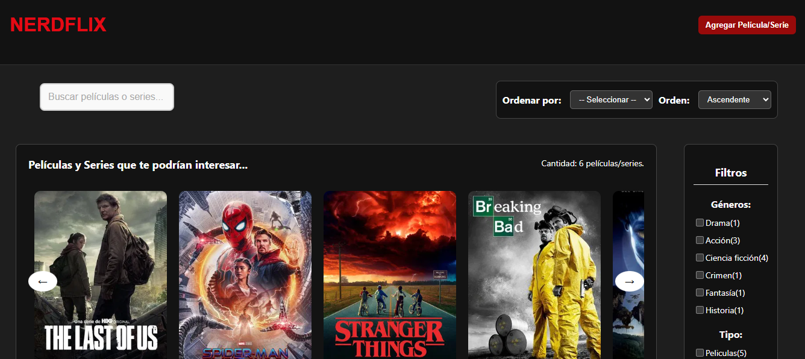
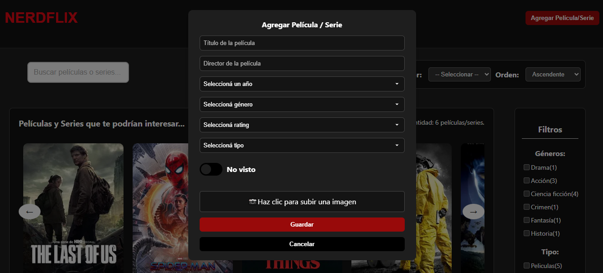
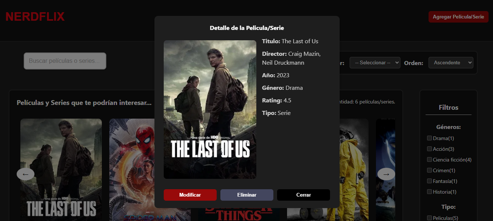
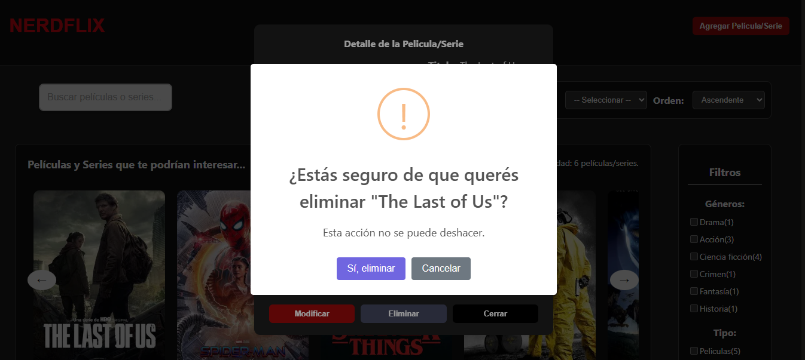

# Proyecto React - Gestor Peliculas y Series "Nerdflix".

 ## 👨‍💻👩‍💻 Integrantes del Grupo

 | Nombre                 | Legajo     |
 |------------------------|------------|
 | Jazmín Loureiro        | FAI-4228   |
 | Nicolás Bucaray        | FAI-4255   |
 | Ailén Flores Montes    | FAI-3547   |
 
 ------------------------------------------------
 
 ## Descripcion de la aplicación.

 Nerdflix es una aplicación web que simula una plataforma para la gestión de películas y series. Permite al usuario visualizar dos listados diferenciados: contenidos vistos y no vistos. Además, ofrece funcionalidades como:
 
 -Acceder a los detalles de cada película o serie.
 
 -Editar, agregar o eliminar contenidos.
 
 -Realizar búsquedas, aplicar filtros y ordenar los resultados.
 
 La aplicación está desarrollada con React y tiene como objetivo aplicar conceptos clave de desarrollo frontend, como el manejo de estados, componentes reutilizables y la creación de una SPA (Single Page Application).
 
 Posee tres archivos iniciales cuya funcion es la siguiente: 
 **index.js**: Es el punto de entrada principal de la aplicación React. Se encarga de renderizar el componente principal (App) dentro del HTML. También importa estilos globales y puede incluir configuraciones como enrutadores o contextos.
 
 **App.js**: Contiene el componente raíz de la aplicación, donde se estructura la interfaz principal y se integran los distintos componentes. Es el núcleo visual y funcional de la app.
 
 **index.css**: Archivo que contiene los estilos globales de la aplicación. Aquí se definen reglas CSS que afectan a todos los componentes, como fuentes, márgenes, resets, o colores base. Se importa en index.js.
 
 **package-json.js**: Archivo de configuración que describe el proyecto. Define:
 
 -Nombre, versión y descripción del proyecto.
 
 -Dependencias necesarias (react, vite, etc.).
 
 -cripts para ejecutar o compilar el proyecto.
 
 -Información útil para otros desarrolladores.
 
 ---
 
 ## Instrucciones de instalación
 
 **1. Clonar el repositorio**
 Abrí una terminal y ejecutá:
 
 git clone https://github.com/AilenFlores/TP-React.git
 
 **2. Ingresar al directorio del proyecto**
 Luego ejecutá:
 
 cd TP-React
 
 **3. Instalar Node.js (si no lo tenés)**
 Asegurate de tener instalado Node.js (recomendado: versión 16 o superior).
 Podés descargarlo desde: https://nodejs.org/
 
 Verificá si ya lo tenés instalado con:
 
 node -v
 npm -v
 
 **4. Instalar las dependencias del proyecto**
 Ejecutá el siguiente comando para instalar React y el resto de los paquetes necesarios:
 
 npm install
 
 **5. Instalar SweetAlert2**
 Ejecutá el siguiente comando para instalar la libreria SweetAlert2:
 
 npm install sweetalert2
 
 **6. Ejecutar la aplicación en modo desarrollo**
 Una vez instaladas las dependencias, iniciá el proyecto con:
 
 npm run dev
 
 Esto va a iniciar un servidor local y te va a mostrar una URL (generalmente http://localhost:5173) para ver la app en el navegador.
 
 
 ## 📸 Capturas de Pantalla
 
 **🎞️ Vista principal con listado**
 
 
 **📝 Modal de edición / formulario**
 
 
 **🔍 Vista de detalles de una película**
 
 
 **⚠️ Alerta de confirmación con SweetAlert2**
 